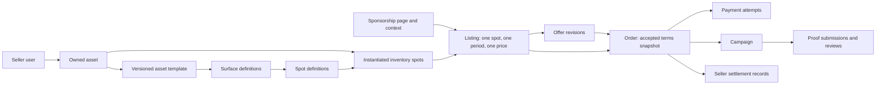

# Billboard.me — Master Product Requirements

**Owner:** founder. **Status:** proposed blueprint for founder review; no product implementation in this PR. **Audit date:** 2026-09-14. **Baseline:** `41949fe` (PR #2). [Audit](../status/current-state.md) describes shipped code; this document describes intended behavior. [Roadmap](../status/roadmap.md) and [backlog](../status/backlog.md) define execution. [AGENTS.md](../../AGENTS.md) remains the sole authority for agent rules.

## Product

Billboard.me helps people who already have real-world distribution sell sponsorship inventory on physical things they own or use. A brand buys a specific placement, context, period and set of deliverables from a particular person. The product initially behaves like a curated sponsorship service with software supporting the transaction.

The problem is not a shortage of objects to advertise on. It is the cost of finding credible, relevant people, agreeing on a placement and price, arranging execution, and proving delivery. Sellers lack a concise sellable package; buyers lack comparable terms and confidence that anything will happen. Merely creating inventory does not create demand.

**Thesis to validate:** a clear, shareable sponsorship page plus reliable fulfillment can make small physical sponsorships worth buying. This is a hypothesis, not a claim of market demand or guaranteed advertising performance.

### Target users and jobs

| User | Initial target | Job to be done | Value proposition |
| --- | --- | --- | --- |
| Seller | Founder-recruited runner, athlete, creator, conference attendee or founder with relevant visibility | Package existing visibility, choose sponsors, earn without running an agency | One credible page, explicit terms, help with execution and payment |
| Buyer | A named person at a brand with budget authority and a relevant audience goal | Test a specific physical sponsorship without coordinating many unknowns | Curated seller, visible placement, clear deliverables, proof and accountable support |
| Founder/operator | Initially one person | Qualify both sides and complete the commercial loop | A small work queue and durable transaction record |

Recruit roughly **10–20 sellers**, but match the first few to actual brand briefs before asking all 20 to build pages. Prefer one coherent context, such as a specific race or conference, over a geographically scattered catalogue. Do not broaden the asset wedge to solve weak demand without an experiment.

### Initial wedge and positioning

- **MacBook** and **Jersey / T-shirt** only. Jersey and T-shirt are one launch family with predefined compatible variants, not separate marketplace systems.
- Founder invites and approves sellers. An authenticated buyer is not automatically an approved seller.
- Direct sharing, founder introductions and brand outreach supply discovery. Publicly readable approved sponsorship pages are compatible with invite-only supply; public seller signup and browse are separate later decisions.
- Position around relevant context and fulfilled commitments. Avoid promising measured impressions, sales lift, guaranteed ROI or verified reach without evidence.
- Preserve the existing media-kit visual identity. Premium means clear terms, real identity, good mobile readability and reliable interactions, not a large animation project.

## Marketplace model

### Inventory is a graph, not the original linear chain

Keep the useful nouns in the original model, but correct the relationships:

A template describes an asset; it is not a child owned by each seller. A surface describes a physical side/region, while a spot is the sellable placement within it. A listing offers that spot for a specific period and terms. The page groups listings into a story, and is not itself a campaign. A campaign exists only after an order is funded. Payment and payout each have separate asynchronous lifecycles.

**V1 constraint:** one seller, one inventory spot, one currency (INR), one contiguous period and one deliverable bundle per order. A page may show several listings, but there is no basket, multi-seller purchase, quantity, recurring billing, split fulfillment or generalized bundle engine. One seller may later sell the same spot for a non-overlapping period. Templates must not create overlapping selectable spots within the same view; shared physical regions need a common conflict key if introduced later.

See the [conceptual schema](../architecture/database.md), [state model](../architecture/transaction-lifecycle.md), [glossary](../../CONTEXT.md) and proposed [ADR-003](../decisions/ADR-003-inventory-and-transaction-boundaries.md). None of these tables exists today except the two waitlists.

### Distribution signals

Represent distribution explicitly, without inventing a universal reach score. The dimensions are digital audience, physical visibility, context, frequency, location and event. Numbers from different dimensions must not be added together or presented as deduplicated impressions.

V1 stores an optional structured, versioned collection of claims on the page: dimension, description, optional amount/unit, relevant period, source link, observed date and provenance (`self_reported` or `founder_checked`). Add social links with platform and URL. Put event name/date/city/context in page fields; exact home addresses and travel itineraries stay private. A small following must not disqualify a seller with relevant physical access.

For example: “800 X followers, checked 12 September” and “running the 10 km race in Bengaluru on 18 October; approximately 3 hours at venue, seller reported.” These are separate signals. Event attendance estimates are not guaranteed views of the jersey. An order snapshots the claims shown at purchase; changing a profile cannot change past representations.

### Pricing, offers and purchase intent

Fixed price is the default anchor. Make Offer, accept, reject and counteroffer are part of the initial intended product, without auctions. Start with one open offer thread per buyer/listing; each counter creates an immutable revision. Only the recipient may accept the latest unexpired revision. A sender can withdraw it. Expired/rejected offers do not reserve inventory.

“Sponsor at ₹X” starts a request at the asking price. **Recommended first-campaign policy:** seller approval of the sponsor and creative category happens before payment, including fixed-price requests. This matches the existing promise that sellers stay in control. An accepted negotiated offer follows the same order path. True instant purchase becomes a controlled-beta option only for explicitly preapproved sponsor/creative conditions; do not label a request “Buy now” if acceptance is still required.

Founder may help communicate and enter draft terms, but buyer and seller must each confirm the actual accepted revision through their authenticated account. No impersonation or inferred acceptance from a waitlist entry. Keep free-text notes short and scoped to the offer; a chat application is unnecessary.

All prices have a basis (the whole stated period), currency, deliverables and production-cost treatment. Store money as integer minor units, rates as basis points and fees as an immutable order snapshot. ₹10,000 with an illustrative 15% platform fee gives ₹1,500 platform revenue and ₹8,500 seller share **before any separately agreed taxes, withholding, provider fees or production costs**. The 15% is not a decided launch rate.

**Conflict requiring resolution:** `hero.tsx` promises no fees while invite-only. Honor that promise for applicable commitments or explicitly agree revised terms before any charge; do not silently deduct a fee. Founder must decide launch fee/waiver, who pays provider charges, printing/delivery costs, applicable taxes, invoicing and rounding before checkout is enabled. The seller sees estimated net proceeds and the buyer sees the full payable total before acceptance.

## UX requirements

### Landing and waitlist

Retain the current routes and lead capture. They are recruitment tools, not the north-star metric. Align “surfaces live,” unsupported impression claims, printing promises and fee copy with founder-approved policy before selling. “Other” remains a research answer on the seller waitlist; it must not become an arbitrary asset-creation option. No public catalogue or fabricated sellers.

### Seller onboarding and asset creation

1. Founder qualifies seller: access to the relevant audience, ability and permission to display sponsorship, communication reliability and upcoming context.
2. Founder sends an expiring invitation bound to email. Seller verifies email and signs in. Invite redemption grants seller eligibility only once; founder can suspend it.
3. Seller supplies public name/handle, short biography, city if relevant, social links and consent to publish chosen information. Private contact data stays private.
4. Choose MacBook or Jersey/T-shirt and a supported template variant. Name the actual object; confirm ownership or permission, size/model compatibility, existing sponsor conflicts and condition.
5. Choose predefined available surfaces/spots in a flat drawing with a matching accessible text list. Start with MacBook exterior lid and garment chest. Template architecture supports back and sleeves; activate them only after physical production validation. Do not expose palm-rest inventory merely because the marketing ticker mentions it.
6. Create page/context, choose exact start/end/timezone, describe visibility, add optional signals/social links, set per-spot fixed total price and state deliverables.
7. Preview public information and net estimate. Submit for founder review; publish only after approval and required fields/rights checks. Seller can unpublish unsold inventory. In P0 a material edit unpublishes the page and returns it to review; it never rewrites accepted orders. Avoid a second parallel public/draft-version workflow.
8. Receive a stable shareable URL and simple next-step guidance. Save drafts and surface field-specific errors; no elaborate dashboard configuration.

For 10–20 sellers, a founder-assisted form and a small list of drafts/live pages/orders are enough. Provider KYC may follow initial profile creation, but active seller settlement eligibility must be confirmed before buyer payment is enabled. Do not collect raw KYC documents in the app if the provider can host onboarding.

### Canonical visuals

Human-authored SVG templates have immutable versions, viewBoxes, surface views and spot coordinates. Coordinates express illustration geometry; actual manufacturing dimensions are separate measured fields with units. Current marketing drawings label SVG coordinate widths/heights as millimeters and are not validated print specifications.

`AssetRenderer` should take a published template version, selected spot IDs, availability and optional approved creative previews. Rendering must not own persistence or pricing. Build a matching keyboard-operable list; tapping a shape must not be the only way to select a spot. New versions must not move sold inventory or change existing order previews. No uploaded executable SVG or arbitrary seller geometry, no AI-generated canonical shapes, no Three.js, no drag-to-size configurator.

### Shareable sponsorship page

This is the principal seller artifact. Proposed canonical route: `/s/{handle}/{pageSlug}`. The user's `@seller/event` format is attractive, but a normal `s` prefix avoids confusion with Next.js `@slot` file conventions and simplifies route ownership. Founder can approve vanity redirects later; stable IDs remain internal. Decide the URL before distribution, reserve system handles and enforce case-insensitive uniqueness.

Required above or close to the fold: seller identity/description, actual asset type, event/context and period, canonical visual, available spot names with prices, and one clear next action. Then show deliverables, relevant distribution claims with provenance, social links, rights/verification scope, cancellation/proof/payment summary and founder support contact. Optional profile photo is useful; invented testimonials, empty review stars or “verified reach” badges are not.

Each spot has textual states: available, awaiting payment/reserved, booked or unavailable. Details and CTA update together. Include “Sponsor at ₹X” and “Make an offer”; disable transaction CTAs for expired/unapproved/ineligible inventory. Preserve selected spot through email sign-in. No buyer login required to read the page; verify the buyer only when submitting intent. Returning buyers see their offer/order status privately.

Pages need mobile layout, keyboard access, useful loading/errors/404, a real social share preview, title/description/canonical URL, and safe public data projection. Founder-approved pages are link-accessible; default `noindex` and omission from a browse index during the pilot is a discovery choice, not access control. Draft/suspended pages require authorization and never leak through metadata, cache or preview images. Sold/expired pages may remain readable with permission, with purchasing disabled and historical terms clearly dated.

### Buyer, order and campaign experience

View page → choose one spot → verify email → give brand/contact and creative/category brief → submit asking-price request or offer → seller responds → buyer accepts any counter → frozen order summary → payment deadline → provider checkout → payment pending/confirmed → campaign preparation.

Buyer should understand what happens next, the response deadline, total cost, who provides artwork, printing/shipping schedule, proof criteria and support channel. Collect only billing information required by the chosen provider/invoice policy. One named buyer can represent a brand in v1; organization membership, procurement workflows and multi-seat approvals are later.

Before payment, validate availability again and atomically reserve the actual spot/period across all listings and pages. Accepted terms include creative restrictions and delivery obligations; later creative approval cannot silently renegotiate the price. Before execution, buyer approves the final creative and founder/seller confirm physical application/production readiness. A failed preparation deadline triggers an explicit cancellation/reschedule decision and buyer consent, not a silent date change.

Use separate panels for order/payment, execution/proof and seller payout status. “Paid” does not mean “campaign completed.” A payment return URL is not evidence that the order is funded. Show pending when provider confirmation is delayed. The [lifecycle specification](../architecture/transaction-lifecycle.md) defines actors, deadlines and failure handling.

## Campaign, proof, payout and trust

The smallest campaign is one funded order with frozen spot/period/context/deliverables, preparation notes, execution state, proof due date and review state. A campaign needs a production/creative checklist and responsible person, not a generalized project-management tool.

Founder handles printing/vendor coordination, shipping and support manually at first, **only after the founder accepts ownership and costs**. Record who supplies artwork, who pays, fit/dimensions, proof of application, shipping deadline and removal/replacement obligations in the order. Existing marketing promises this service; ignoring it would make an otherwise complete payment flow commercially unusable.

Proof starts with private photos and optional evidence URLs; short video can be accepted manually through an agreed secure process until upload demand justifies native support. Each submission has submitter/time, claimed capture date/context, files/links and notes. Seller can resubmit; original rejected submissions and reviewer reasons remain. Content is evidence of agreed deliverables, not audited advertising impressions.

Founder reviews proof manually against the frozen checklist; buyer can acknowledge or raise an issue. Proposed pilot deadlines are offer response within 48 hours, payment within 24 hours of acceptance, proof within 48 hours of campaign end and buyer review within 72 hours of submission. These are founder-owned defaults requiring confirmation and must fit provider settlement limits and production lead time. No automatic payout or proof acceptance just because the buyer is silent; founder resolves it within a defined support SLA.

Payout eligibility requires funded order, approved proof, completed campaign, active provider seller account and no open blocking refund/dispute. Provider rules may prevent holding settlement until proof for long campaigns: restrict pilot booking horizon/duration to a verified schedule, or explicitly revise the commercial flow with founder/legal/provider approval. Never simulate escrow with an internal wallet or quietly collect funds into a personal bank account.

The app records provider transfers/settlements and bank-success evidence. A successful transfer request is not successful seller payout. Failed/unknown payouts are reconciled before retrying; the campaign remains executed but the north-star loop is incomplete. Post-payout disputes remain possible and use the agreed provider recovery process.

| Trust capability | Before first transaction | Before public marketplace | Later |
| --- | --- | --- | --- |
| Verified email and seller invitation | Required | Required | Maintain |
| Founder checks seller identity/access/placement permission and sponsor conflicts | Required, scope recorded | Consistent documented process | Risk-based automation if warranted |
| Provider KYC and settlement eligibility | Required before money moves | Required | Additional regions separately approved |
| Proof criteria, private storage, manual review, support, refund/dispute procedure | Required | Required with staffed escalation | Assisted verification after evidence |
| Social links and claim provenance | Required when claims are shown; manual checks | Clear badges and complaint process | OAuth verification where useful |
| Campaign count/history | Derive internally from settled verified campaigns | Consent-based public history | Richer reputation |
| Reviews | No empty ratings or fabricated reviews | Only verified buyers, moderation/appeal | Ranking signals after abuse validation |
| Automated fraud detection | Manual checks suffice | Basic abuse controls required | Models only with demonstrated signal |

## First vertical slice

One invited seller publishes one approved page offering one validated MacBook lid or garment chest for a short, explicit period. A real introduced buyer submits an asking-price request or offer. Both agree to frozen terms; the system reserves the spot; the buyer pays through one approved marketplace provider; founder coordinates creative/application; seller executes and submits private photos; founder reviews, buyer has an agreed issue window; provider settles to seller; founder reconciles and records costs and lessons.

**This is the first thing the team should make work end-to-end.** Build against one scenario from the outset, using provider sandbox money until commercial, security and operational gates pass. Offer counters are a bounded capability in the same model, but the first campaign need not exercise every negotiation branch. The team must demonstrate failure/retry/cancellation paths before enabling real charges.

Manual work: seller recruitment, brand matching, rights checks, pricing advice, creative approval, production/shipping, proof review and dispute decisions. Software must reliably own identity, access, accepted terms, exclusivity, money references, state transitions and evidence retention. A provider dashboard action is permissible for exceptional refund/release operations if it is reconciled into the order history; editing database money states by hand is not.

## Product lifecycle and gates

Stage numbers describe product maturity, not separate teams or permission to build everything concurrently. P0 means necessary for the first paid campaign; P1 controlled beta; P2 public marketplace; P3 future hypothesis.

| Stage | Outcome | Exit evidence |
| --- | --- | --- |
| 0 — Current repository | Landing + waitlists | Audit, baseline checks; no claimed marketplace functionality |
| 1 — Engineering foundation | Private data, explicit env, repeatable tests/CI, deploy feasibility | Denied client DB access, disposable test DB, passing checks, runtime decision |
| 2 — Domain foundation | Auth/roles, versioned templates, assets/spots and transaction contracts | Approved domain ADR, ownership and migration tests |
| 3 — Seller MVP | Invited seller creates real inventory and drafts listing | Owner-only form, valid period/price, founder review |
| 4 — Sponsorship pages | Publish and share approved truthful inventory | Responsive page, public/private projections, CTA state and share preview |
| 5 — Buyer/offer flow | Asking-price requests and versioned negotiations | Verified buyer and explicit mutual acceptance, expiry/reject/counter |
| 6 — Orders | Frozen deal with exclusive time-bound reservation | Concurrent acceptance/retry tests; no double booking |
| 7 — Payments | Approved provider onboarding/collection/reconciliation | Sandbox webhook/retry/refund tests; commercial approval before live mode |
| 8 — Campaign execution | Creative/production ready; agreed placement runs | Responsible operator, deadlines, campaign transition history |
| 9 — Proof/payout | Private evidence reviewed; seller bank settlement verified | Rejection/resubmission and failed-payout rehearsal; funds reconcile |
| 10 — First real campaign | First one, then 1–5 completed loops | Paid buyer, approved proof, successful payout; real cost/time/feedback review |
| 11 — Public beta | Public interest intake; controlled admitted cohort to 10 campaigns | Founder capacity, repeat demand, support and repeatability; still curated supply |
| 12 — Marketplace expansion | Gradual public application/catalogue; work toward 100 campaigns | Quality/rights checks, low unresolved loss, unit economics and buyer demand justify discovery |
| 13 — Future | Evidence-led additional templates/regions/workflows | Specific experiment and founder decision before each expansion |

Do not equate 10 or 100 campaigns with an automatic launch decision. “Public beta” does not silently authorize unrestricted seller publishing. Founder must approve each widening of access after reviewing demand, successful settlement, disputes and operating capacity. Campaign-count targets are learning checkpoints, not forecast dates.

## Metrics

**North star: completed paid campaigns with verified proof and successful seller payout.** Count distinct campaigns with captured payment, operator-approved proof, completed execution and provider-confirmed seller settlement, excluding test/self-funded/fraudulent/full-refund loops. Reopened disputes or reversed payouts leave the currently successful count until resolved; report historical completions and later reversals separately. An accepted offer, successful browser redirect or initiated transfer never qualifies.

| Funnel step | Record | Useful measure / decision |
| --- | --- | --- |
| Waitlist | Kind, submission date, source if known, contact consent | Follow-up coverage and qualified share; not raw growth |
| Qualified seller | Founder decision, context, reason, invited date | Relevant supply for actual briefs; time to qualify |
| Published page | Seller/page IDs, published time, available periods | Completion rate from invite; time spent onboarding |
| Brand interest | Page/spot and CTA event; founder introduction source | Qualified interest per shared page; prevent counting own previews |
| Offer/request | Buyer/listing, amount, source, revision and response time | Request-to-acceptance, counter frequency, no-response rate |
| Paid order | Captured amount, currency, fee snapshot, dates | Acceptance-to-paid conversion, failures and abandonment |
| Campaign | Scheduled/start/end and readiness | On-time execution, cancellation and production cost |
| Proof | Submitted/reviewed timestamps and revision reason | Timely acceptance, rework and buyer complaints |
| Payout | Provider settlement reference/amount/time | Bank-success rate, days to payout, unresolved amount |

Founder keeps a weekly cohort sheet/report keyed to durable IDs for 1–5 campaigns. Record denominators, dates, amounts refunded, provider charges, printing/shipping, founder minutes and buyer repeat intent. Distinguish observed cost from unpaid founder labor. Basic server-derived milestones suffice; PostHog dashboards are P1 and do not own financial truth. Minimize analytics identifiers and never send evidence, emails, payment details or exact locations to analytics.

## Validation Experiments

Thresholds below are proposed decision rules for a tiny sample, not statistical proof. Founder records interviews/quotes and adverse evidence; no implementation agent may declare validation from page views.

| ID | Hypothesis | Experiment | Success metric | Decision enabled |
| --- | --- | --- | --- | --- |
| V1 | Sellers will actually display a sponsor | Show exact removable decal/print mockup and written obligations to 10 qualified sellers | At least 5 opt in with specific spot/period and rights confirmed | Recruit cohort or change packaging |
| V2 | A narrow context has buyer demand | Interview 10 relevant budget owners with 2–3 real proposed placements | At least 3 agree a concrete brief/budget, then at least 1 external buyer pays | Proceed with transaction build/launch; revise wedge if not |
| V3 | A shared page reduces explanation | Give 5 buyers a truthful page prototype and ask them to explain the deal unaided | 4/5 identify seller, spot, period, deliverables, total and next step | Page information hierarchy |
| V4 | Asking prices are plausible | Collect 10 seller asks and 5 buyer ranges for the same bundle; run first requests | At least one mutually acceptable price; record all gaps and production costs | Price guidance, fee waiver, bundle scope |
| V5 | Negotiation is worth buyer friction | Offer both asking-price request and Make Offer for first 10 qualified intents | Measure acceptance/time/counter usage; no preset need for complex negotiation | Keep simple offers; consider instant approval only with consent |
| V6 | Proposed spots can physically fulfill promises | Apply/remove sample decal or print on each activated variant; check event/team rules | Fit/readability/removal and permission pass; known lead time and unit cost | Activate lid/chest; defer unsafe spots |
| V7 | Buyers accept affordable proof | Agree proof checklist before payment; review first 1–5 campaigns | All paid pilot orders have agreed criteria; record resubmissions and objections | Improve checklist before automating verification |
| V8 | The transaction can sustain operations | Track full cost and founder minutes for 1–5, then 10 campaigns | Agreed contribution-margin target and labor budget; no overdue unresolved payout | Fee/price changes or reduce operational scope |
| V9 | Buyers return and adjacent inventory is needed | Recontact paid buyers after completion with same and alternate placement | At least 2 independent repeat commitments before catalogue expansion; actual requests for new type | P2 discovery and P3 template experiments |

V1/V2/V4/V6 and provider eligibility can run while engineering secures the current app. Stop or narrow work if no credible seller/buyer match emerges. Do not turn every failed hypothesis into a software feature.

## Concerns and decisions

| Concern | Why it matters / evidence or reasoning | Severity | Recommended action | Resolve by |
| --- | --- | --- | --- | --- |
| Buyers may not value ambient object visibility | No paid-campaign evidence exists; visibility is not attributable outcomes | Critical product | V2, sell a clear context/deliverable before growing supply | Before live launch; revisit at 1–5 |
| Provider eligibility or settlement timing may block the model | Marketplace access is conditional; proof may arrive after permitted hold | Critical commercial | Written provider confirmation and a short pilot period; no escrow workaround | Before payment implementation/live collection |
| Waitlist PII access is not established | Migration has no RLS/grants; actual exposure depends on deployment configuration | High engineering | Access isolation migration and role-level test | First coding issue |
| Fee/fulfillment promises are inconsistent with economics | Landing says no fees and promises print/delivery | High product | Founder fee policy, fulfillment trial and truthful copy | Before publishing payable terms |
| Seller may lack advertising rights | Teams, events, employers and existing sponsors may restrict inventory | High operational | Manual permission/exclusivity check; reject unavailable rights | Before page approval |
| Long campaigns and production delays | Delivery logistics precede execution; payment timing can conflict | High operational | Short pilot, explicit lead times, refund/reschedule rules | Before acceptance/payment |
| Brand approval and fixed-price flow conflict | Sellers promise control over sponsor; instant payment may create unwanted obligations | High UX | Seller-approved asking-price request in P0; test preapproval later | Domain/order decision |
| Fraud/disputes despite photos | Photos prove a moment, not the promised frequency; links can disappear | High trust | Explicit deliverables, preserved private evidence, manual dispute review | Before payment terms |
| Tax, invoices, advertising disclosures and liability unclear | The app cannot choose legal merchant structure from a payment API | High commercial | Founder with qualified advice confirms India obligations and contract allocation | Before live money |
| Engineering may outpace commercial learning | Most domain code is missing; building a generic marketplace could consume the runway | High strategy | One end-to-end scenario, paid-demand gate and Not Yet list | Every stage gate |
| Runtime preference may add integration work | No Cloudflare deployment exists; dependencies require exact compatibility validation | Medium engineering | Timeboxed runtime spike; managed Node fallback | Foundation |
| Off-platform negotiation and founder workload | Both sides meet directly; value must survive outside discovery | Medium business | Measure coordination cost and repeat intent; sell reliable execution | At 1–5 and 10 campaigns |

Founder approval is needed for: proposed domain/immutable terms model (ADR-003); public sponsorship-page stage transition and URL; seller approval before payment; fee/waiver and production ownership; provider/legal funds flow; deadlines/cancellation/proof authority; deployment fallback/storage deviation if required; expansion gates and success thresholds. Issue existence is not approval of an unresolved product decision. Record decisions in the linked decision/validation issues; preserve accepted ADR history.

## Not Yet

Public marketplace browse, unrestricted seller publishing, advanced search/filters, auctions, recommendation/ranking engines, arbitrary asset types, 3D/Three.js, AI canonical geometry, native mobile apps, microservices, Redis, Elasticsearch, Kubernetes, custom wallet, custom escrow, multiple live payment providers, multicurrency/cross-border payouts, subscriptions, multi-seller carts, sophisticated analytics, automated fraud/proof scoring, complex seller dashboards, advanced brand organizations, chat, full campaign project management, automated print logistics, social scraping and unearned verification badges.

Demand must justify each expansion. The generalized template and reservation model is enough future-proofing for the first transaction; dormant frameworks and speculative tables are not required.
