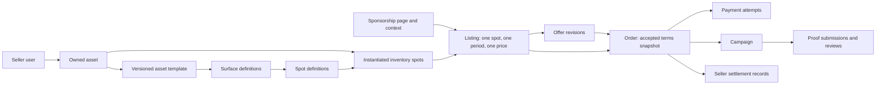

# Billboard.me — Master Product Requirements

**Owner:** founder. **Status:** PR #52 blueprint reconciled to the founder’s marketplace direction on 2026-09-15; unsettled policies remain proposed. **Repository baseline:** `8171a2d` (PR #54 and PR #53 merged). No product implementation in this reconciliation. [Audit](../status/current-state.md) describes shipped code; this document describes intended behavior. [Roadmap](../status/roadmap.md) and [backlog](../status/backlog.md) define execution. [AGENTS.md](../../AGENTS.md) remains the sole authority for agent rules.

## Product

Billboard.me helps people who already have real-world distribution sell sponsorship inventory on physical things they own or use. A brand buys a specific placement, context, period and set of deliverables from a particular person. Billboard.me is the marketplace and transaction infrastructure connecting the sponsor with the seller. The seller supplies the physical sponsorship; Billboard.me facilitates the agreement, payment, records and support.

The problem is not a shortage of objects to advertise on. It is the cost of finding credible, relevant people, agreeing on a placement and price, arranging execution, and proving delivery. Sellers lack a concise sellable package; buyers lack comparable terms and confidence that anything will happen. Merely creating inventory does not create demand.

**Thesis to validate:** curated inventory, a clear shareable page and reliable transaction infrastructure can make seller-delivered physical sponsorships worth buying. This is a hypothesis, not a claim of market demand or guaranteed advertising performance.

### Target users and jobs

| User | Initial target | Job to be done | Value proposition |
| --- | --- | --- | --- |
| Seller | Founder-recruited runner, athlete, creator, conference attendee or founder with relevant visibility | Package existing visibility, choose sponsors, earn without running an agency | One credible page, explicit terms, communication and payment infrastructure |
| Buyer | A named person at a brand with budget authority and a relevant audience goal | Test a specific physical sponsorship without coordinating many unknowns | Curated seller, visible placement, clear deliverables, proof and accountable support |
| Founder/operator | Initially one person | Qualify both sides and complete the commercial loop | A small work queue and durable transaction record |

Recruit roughly **10–20 sellers**, but match the first few to actual brand briefs before asking all 20 to build pages. Prefer one coherent context, such as a specific race or conference, over a geographically scattered catalogue. Do not broaden the asset wedge to solve weak demand without an experiment.

### Initial wedge and positioning

- **MacBook** and **Jersey / T-shirt** only. Jersey and T-shirt are one launch family with predefined compatible variants, not separate marketplace systems.
- Founder invites and approves sellers. An authenticated buyer is not automatically an approved seller.
- Direct sharing, founder introductions and brand outreach supply discovery. Publicly readable approved sponsorship pages are compatible with invite-only supply; public seller signup and browse are separate later decisions.
- Position around relevant inventory and clearly attributed commitments. Do not promise seller attendance, physical fulfillment, sponsorship effectiveness, measured impressions, sales lift or ROI. Verification labels describe only the checks actually performed.
- Preserve the existing media-kit visual identity. Premium means clear terms, real identity, good mobile readability and reliable interactions, not a large animation project.

## Responsibilities and marketplace boundary

Sponsor → Billboard.me transaction infrastructure → seller/inventory owner is a commercial bridge. It is neither a fulfillment guarantee nor passive classifieds. The platform provides the complete listing → negotiation → order → payment → campaign record → evidence → support/dispute experience.

| Party | Responsibilities | Boundary |
| --- | --- | --- |
| Seller | Accurately describe asset, available spots, dates, context and distribution; possess rights to sell/display sponsorship; disclose conflicts; fulfill agreed commitments; communicate material changes; provide evidence where agreed; comply with applicable event/advertising rules | A seller who fails to attend the Bengaluru Marathon has failed their own commitment. Founder invitation does not transfer that commitment to Billboard.me |
| Sponsor / buyer | Evaluate seller, inventory, context, claims and terms; decide value/risk; supply appropriate creative/materials and approvals on time; pay agreed amounts; communicate concerns | The purchase decision and marketing expectations belong to the sponsor; receiving platform support does not imply guaranteed ROI |
| Billboard.me | Operate secure, accurate transaction infrastructure; curate sellers/listings with stated check scope; correct known misleading information; provide participant communication, policies, records, trust signals and support; correctly integrate payments and protect data | Does not inherently promise future attendance, execution, audience size, performance or recovery in every dispute. Remains responsible for its own platform failures and applicable legal/provider obligations |

Invite-only is an initial trust control: founder invitation → identity/context review → seller inventory → scoped listing approval → independent sponsor evaluation. It reduces selection and quality risk; it does not eliminate nonperformance, false claims or event restrictions. Record what was checked, by whom and when. “Identity checked” cannot become “campaign guaranteed.”

This boundary follows the founder’s explicit direction; it is **not a legal conclusion or a waiver of statutory duties**. Seller/sponsor contracts, the platform’s liability, provider configuration and marketplace policy require external validation and founder approval through DECISION-001/PAY-001. A future managed/guaranteed service would require separate terms, economics and an ADR. See [ADR-005](../decisions/ADR-005-marketplace-responsibility-and-settlement-model.md).

## Marketplace model

### Inventory is a graph, not the original linear chain

Keep the useful nouns in the original model, but correct the relationships:

A template describes an asset; it is not a child owned by each seller. A surface describes a physical side/region, while a spot is the sellable placement within it. A listing offers that spot for a specific period and terms. The page groups listings into a story, and is not itself a campaign. A campaign exists only after an order is funded. Payment, provider settlement, campaign fulfillment, evidence and disputes have independent lifecycles. There is no proof → settlement dependency.

**V1 constraint:** one seller, one inventory spot, one currency (INR), one contiguous period and one deliverable bundle per order. A page may show several listings, but there is no basket, multi-seller purchase, quantity, recurring billing, split fulfillment or generalized bundle engine. One seller may later sell the same spot for a non-overlapping period. Templates must not create overlapping selectable spots within the same view; shared physical regions need a common conflict key if introduced later.

See the [conceptual schema](../architecture/database.md), [state model](../architecture/transaction-lifecycle.md), [glossary](../../CONTEXT.md) and proposed [ADR-003](../decisions/ADR-003-inventory-and-transaction-boundaries.md). None of these tables exists today except the two waitlists.

### Distribution signals

Represent distribution explicitly, without inventing a universal reach score. The dimensions are digital audience, physical visibility, context, frequency, location and event. Numbers from different dimensions must not be added together or presented as deduplicated impressions.

V1 stores an optional structured, versioned collection of claims on the page: dimension, description, optional amount/unit, relevant period, source link, observed date and provenance (`self_reported` or `founder_checked`). Add social links with platform and URL. Put event name/date/city/context in page fields; exact home addresses and travel itineraries stay private. A small following must not disqualify a seller with relevant physical access.

For example: “800 X followers, checked 12 September” and “running the 10 km race in Bengaluru on 18 October; approximately 3 hours at venue, seller reported.” These are separate signals. Event attendance estimates are not guaranteed views of the jersey. An order snapshots the claims shown at purchase; changing a profile cannot change past representations.

### Pricing, offers and purchase intent

Fixed price is the default anchor. Make Offer, accept, reject and counteroffer are part of the initial intended product, without auctions. Start with one open offer thread per buyer/listing; each counter creates an immutable revision. Only the recipient may accept the latest unexpired revision. A sender can withdraw it. Expired/rejected offers do not reserve inventory.

“Sponsor at ₹X” starts a request at the asking price. **Recommended first-campaign policy:** seller approval of the sponsor and creative category happens before payment, including fixed-price requests. This matches the existing promise that sellers stay in control. An accepted negotiated offer follows the same order path. True instant purchase becomes a controlled-beta option only for explicitly preapproved sponsor/creative conditions; do not label a request “Buy now” if acceptance is still required.

Founder may help communicate and enter draft terms, but buyer and seller must each confirm the actual accepted revision through their authenticated account. No impersonation or inferred acceptance from a waitlist entry. Keep free-text notes short and scoped to the offer. After acceptance, participants can add private timestamped order messages for creative references, material changes and support; notify the other party and preserve history. A realtime chat application is unnecessary.

All prices have a basis (the whole stated period), currency, deliverables and production-cost treatment. Store money as integer minor units, rates as basis points and fees as an immutable order snapshot. ₹10,000 with an illustrative 15% platform fee gives ₹1,500 platform revenue and ₹8,500 seller share **before any separately agreed taxes, withholding, provider fees or production costs**. The 15% is not a decided launch rate.

**Conflict requiring resolution:** `hero.tsx` promises no fees while invite-only. Honor that promise for applicable commitments or explicitly agree revised terms before any charge; do not silently deduct a fee. Founder must decide launch fee/waiver, who pays provider charges, printing/delivery costs, applicable taxes, invoicing and rounding before checkout is enabled. The seller sees estimated net proceeds and the buyer sees the full payable total before acceptance.

## UX requirements

### Landing and waitlist

Retain the current routes and lead capture. They are recruitment tools, not the north-star metric. Align “surfaces live,” unsupported impression claims, printing promises and fee copy with founder-approved policy before selling. “Other” remains a research answer on the seller waitlist; it must not become an arbitrary asset-creation option. No public catalogue or fabricated sellers.

### Seller onboarding and asset creation

1. Founder qualifies seller: access to the relevant audience, ability and permission to display sponsorship, communication reliability and upcoming context.
2. Founder sends an expiring invitation bound to email. Seller verifies email and signs in. Invite redemption grants seller eligibility only once; founder can suspend it.
3. Seller supplies public name/handle, short biography, city if relevant, social links and consent to publish chosen information. Private contact data stays private.
4. Choose MacBook or Jersey/T-shirt and a supported template variant. Name the actual object; confirm ownership or permission, size/model compatibility, existing sponsor conflicts and condition.
5. Choose predefined available surfaces/spots in a flat drawing with a matching accessible text list. Start with MacBook exterior lid and garment chest. Template architecture supports back and sleeves; activate them only after physical production validation. Do not expose palm-rest inventory merely because the marketing ticker mentions it.
6. Create page/context, choose exact start/end/timezone, describe visibility, add optional signals/social links, set per-spot fixed total price and state deliverables.
7. Preview public information and net estimate. Submit for founder review; publish only after approval and required fields/rights checks. Seller can unpublish unsold inventory. In P0 a material edit unpublishes the page and returns it to review; it never rewrites accepted orders. Avoid a second parallel public/draft-version workflow.
8. Receive a stable shareable URL and simple next-step guidance. Save drafts and surface field-specific errors; no elaborate dashboard configuration.

For 10–20 sellers, a founder-assisted form and a small list of drafts/live pages/orders are enough. Provider KYC may follow initial profile creation, but active seller settlement eligibility must be confirmed before buyer payment is enabled. Do not collect raw KYC documents in the app if the provider can host onboarding.

### Canonical visuals

Human-authored SVG templates have immutable versions, viewBoxes, surface views and spot coordinates. Coordinates express illustration geometry; actual manufacturing dimensions are separate measured fields with units. Current marketing drawings label SVG coordinate widths/heights as millimeters and are not validated print specifications.

`AssetRenderer` should take a published template version, selected spot IDs, availability and optional approved creative previews. Rendering must not own persistence or pricing. Build a matching keyboard-operable list; tapping a shape must not be the only way to select a spot. New versions must not move sold inventory or change existing order previews. No uploaded executable SVG or arbitrary seller geometry, no AI-generated canonical shapes, no Three.js, no drag-to-size configurator.

### Shareable sponsorship page

This is the principal seller artifact. Proposed canonical route: `/s/{handle}/{pageSlug}`. The user's `@seller/event` format is attractive, but a normal `s` prefix avoids confusion with Next.js `@slot` file conventions and simplifies route ownership. Founder can approve vanity redirects later; stable IDs remain internal. Decide the URL before distribution, reserve system handles and enforce case-insensitive uniqueness.

Required above or close to the fold: seller identity/description, actual asset type, event/context and period, canonical visual, available spot names with prices, and one clear next action. Then show deliverables, relevant distribution claims with provenance, social links, rights/verification scope, seller/sponsor obligations, cancellation/evidence/normal-settlement summary and support contact. Optional profile photo is useful; invented testimonials, empty review stars or “verified reach” badges are not.

Each spot has textual states: available, awaiting payment/reserved, booked or unavailable. Details and CTA update together. Include “Sponsor at ₹X” and “Make an offer”; disable transaction CTAs for expired/unapproved/ineligible inventory. Preserve selected spot through email sign-in. No buyer login required to read the page; verify the buyer only when submitting intent. Returning buyers see their offer/order status privately.

Pages need mobile layout, keyboard access, useful loading/errors/404, a real social share preview, title/description/canonical URL, and safe public data projection. Founder-approved pages are link-accessible; default `noindex` and omission from a browse index during the pilot is a discovery choice, not access control. Draft/suspended pages require authorization and never leak through metadata, cache or preview images. Sold/expired pages may remain readable with permission, with purchasing disabled and historical terms clearly dated.

### Buyer, order and campaign experience

View page → choose one spot → verify email → give brand/contact and creative/category brief → submit asking-price request or offer → seller responds → buyer accepts any counter → frozen order summary → payment deadline → provider checkout → payment pending/confirmed → campaign preparation.

Buyer should understand what happens next, the response deadline, total cost, who provides artwork, seller-owned production arrangements and dates, agreed evidence requirements, settlement timing and support channel. Collect only billing information required by the chosen provider/invoice policy. One named buyer can represent a brand in v1; organization membership, procurement workflows and multi-seat approvals are later.

Before payment, validate availability again and atomically reserve the actual spot/period across all listings and pages. Accepted terms include creative restrictions and delivery obligations; later creative approval cannot silently renegotiate the price. Before execution, buyer and seller confirm the agreed creative and seller records physical preparation status. The seller owns fulfillment; the founder may help with coordination by explicit agreement. A failed preparation deadline triggers an explicit cancellation/reschedule decision and buyer consent, not a silent date change.

Use separate panels for order/payment, execution/proof and seller payout status. “Paid” does not mean “campaign completed.” A payment return URL is not evidence that the order is funded. Show pending when provider confirmation is delayed. The [lifecycle specification](../architecture/transaction-lifecycle.md) defines actors, deadlines and failure handling.

## Campaign, proof, payout and trust

### Payment and settlement

**Recommended default, subject to provider eligibility and founder approval:** sponsor pays the provider; provider allocates the configured Billboard.me fee and seller share, then settles on its normal approved schedule. Settlement may occur before the event or before any proof. It is not conditional on founder approval of fulfillment. A provider-imposed KYC/risk block is different from a product hold.

- **Payment:** sponsor’s captured money, confirmed by the provider.
- **Platform fee:** Billboard.me’s agreed commission; configurable and snapshotted, not necessarily net profit.
- **Seller share:** the contractually allocated amount after the agreed fee/cost treatment; not a spendable app balance.
- **Settlement / payout:** actual provider movement to the seller’s bank. Allocation or a successful API request alone does not establish bank receipt.

One approved marketplace provider still needs individual-seller/KYC support, commission allocation, refunds, reversals, disputes and reconciliation. [Dated provider research](../architecture/payments.md) compares Route, Easy Split, Stripe India and Dodo. **Requires external validation:** eligibility/turnover, category, operating entity, payee/merchant roles, tax/invoices, advance-service rules, schedules and loss liability. Removing proof holds does not remove these gates. No custom wallet, escrow or personal-bank workaround.

Deferred settlement is optional future scope only after an explicit founder/provider/legal decision. It is not a required PaymentService operation or MVP acceptance criterion. Failed/unknown/reversed settlement remains visible and reconciled before retry. A completed campaign can have failed settlement; a settled seller can subsequently fail to fulfill. Financial facts must survive either outcome.

### Campaign and evidence

One funded order creates one campaign record containing the purchased spot/period/context/deliverables, seller’s preparation/execution reports, agreed creative references, due dates and completion basis. Seller fulfillment is distinct from sponsor acknowledgement and from operator support. No mandatory platform production department, readiness approval or adjudication engine.

Seller supplies or arranges production/application/removal unless the accepted order explicitly assigns a named task elsewhere. Sponsor supplies appropriate creative and approvals. Validate physical fit and costs before activating templates. Correct the existing print/delivery and proof-release marketing promises in PAGE-002; do not turn unsupported copy into a default fulfillment service. Honor any actual prior commitments or explicitly renegotiate them.

**P0 evidence:** private text/HTTPS references, submitter/time, claimed capture date/context, revisions and participant responses. Sponsors can acknowledge, request clarification or contest; the seller can resubmit. Native photo uploads and validated file storage move to P1 MEDIA-001. Do not server-fetch arbitrary URLs or treat external links as durable bytes; record an attributed review summary/reference while accessible. If a particular order or provider requires retained original files, approve a secure retention process or advance MEDIA-001 before accepting that order. Never publish private proof by default.

Evidence supports sponsor confidence, campaign history, reputation and disputes. The founder may facilitate review, record checks or moderate prohibited content. A review must identify the actor and scope; it does not certify every physical-world claim. Whether evidence is mandatory for each order, acceptable formats, retention, review deadlines and optional manual checks remain DECISION-001 decisions. Recommended pilot: agree a lightweight evidence requirement before purchase, with sponsor review, independent of settlement.

Proposed pilot deadlines remain 48 hours for offer response, 24 hours for payment after acceptance, 48 hours after campaign end for agreed evidence and 72 hours for sponsor response. Founder must approve them with feasible lead times and support capacity. Evidence deadlines do not have to precede normal settlement. Sponsor silence triggers reminder/support and an unresolved or unconfirmed outcome, not automatic verification, a payment block or assumed consent.

### Disputes and completion

Distinguish party complaints from provider payment disputes. Preserve frozen listing terms, acceptance, messages, evidence and financial records. Initial support gathers both parties’ accounts, facilitates an agreed resolution and applies an approved deterministic policy where authorized. It may record unresolved/escalated cases without declaring disputed physical facts true. The founder is not required to arbitrate every real-world disagreement.

Refund/cancellation eligibility, who may authorize it, partial fulfillment, seller nonattendance, event cancellation, cure periods, support windows and recovery after settlement require a published versioned policy. A complaint does not automatically halt provider settlement or guarantee buyer reimbursement; use only actual permitted provider controls. Provider/network chargeback outcomes and deadlines remain authoritative for those financial events. Billboard.me’s own technical failures require platform remedies under its policy and obligations.

Campaign completion records its basis: sponsor acknowledgement of agreed delivery or an explicit documented party resolution. Seller report alone, elapsed time or operator closure of an unresolved complaint is not verified completion. Cancellation, refund and closure are separate facts; no refund is marked successful until provider-confirmed. Evidence approval has **no settlement side effect**.

| Trust capability | Before first transaction | Before public marketplace | Later |
| --- | --- | --- | --- |
| Verified email and curated seller identity/context | Required, check scope/date recorded; no fulfillment guarantee | Consistent admission, removal and appeal policy | Risk-based tooling if warranted |
| Seller rights/accuracy obligations and conflicts | Required attestation plus founder’s scoped check | Consistent review and complaints handling | Further verification when justified |
| Provider KYC and settlement eligibility | Required under approved flow before collection | Required | Other regions separately validated |
| Agreed evidence policy, private record, sponsor response and support | Required capability; specific evidence obligation decided per terms | Retention/moderation capacity, native files if needed | Assisted verification after evidence |
| Social links and claim provenance | Required when claims shown | Explain badges and corrections | OAuth checks if useful |
| Campaign count/history | Internally derive attributable outcomes and settled amounts | Consented history with provenance | Richer reputation |
| Reviews | No invented reviews | Verified transaction participants, moderation and appeal; completion eligibility policy explicit | Ranking only after abuse validation |
| Fraud controls | Manual curated checks; no guarantee implied | Observed-abuse controls | Models only with useful signal |

## First vertical slice

**Previous dependency:** seller → listing → sponsor → payment → campaign → proof → Billboard.me approval → payout.

**Reconciled minimum:** invited seller → approved inventory/page → sponsor request or offer → mutual acceptance and reserved order → provider-confirmed payment. From there two independent paths run:

1. Provider allocates the fee and seller share → normal settlement → reconciliation/failure support.
2. Seller fulfills agreed placement → submits expected/agreed evidence → sponsor acknowledges or raises an issue → campaign outcome recorded.

Use one validated MacBook lid or garment chest, one seller, one sponsor, one spot/period and INR. Include fixed-price requests and bounded counters in the same model; the first transaction need not exercise every branch. A transaction can finish its payment path before the event. It counts toward the strongest success metric only when all required outcome facts later exist.

**This is the first thing the team should make work end-to-end.** Software owns identity/access, approved public facts, mutually accepted terms, exclusive inventory, signed payment events, normal settlement records, private participant messages/evidence and support/refund/dispute history. Founder recruitment, scoped curation and support can stay manual. Seller physical fulfillment stays with the seller; no mandatory founder printing, proof approval or release command.

P0 supports lightweight evidence references and sponsor response; native uploads are P1 unless agreed retention requirements make them necessary earlier. Provider dashboard operations may handle exceptional financial support only with authorized reasons and reconciliation. Never edit database money states to assert success. Rehearse nonperformance **after settlement**, unresolved complaints and failure/retry/cancellation paths in sandbox before live money. Production eligibility and founder go/no-go remain required.

## Product lifecycle and gates

Stage numbers describe product maturity, not separate teams or permission to build everything concurrently. P0 means necessary for the first paid campaign; P1 controlled beta; P2 public marketplace; P3 future hypothesis.

| Stage | Outcome | Exit evidence |
| --- | --- | --- |
| 0 — Current repository | Landing + waitlists | Audit, baseline checks; no claimed marketplace functionality |
| 1 — Engineering foundation | Private data, explicit env, repeatable tests/CI, deploy feasibility | Denied client DB access, disposable test DB, passing checks, runtime decision |
| 2 — Domain foundation | Auth/roles, versioned templates, assets/spots and transaction contracts | Approved domain ADR, ownership and migration tests |
| 3 — Seller MVP | Invited seller creates real inventory and drafts listing | Owner-only form, valid period/price, founder review |
| 4 — Sponsorship pages | Publish and share approved truthful inventory | Responsive page, public/private projections, CTA state and share preview |
| 5 — Buyer/offer flow | Asking-price requests and versioned negotiations | Verified buyer and explicit mutual acceptance, expiry/reject/counter |
| 6 — Orders | Frozen deal with exclusive time-bound reservation | Concurrent acceptance/retry tests; no double booking |
| 7 — Payments | Approved provider onboarding/collection/reconciliation | Sandbox webhook/retry/refund tests; commercial approval before live mode |
| 8 — Campaign execution | Seller carries out agreed placement; parties communicate | Named seller obligations, change notices and attributed campaign status |
| 9 — Evidence and settlement outcomes | Sponsor response/evidence history alongside independently reconciled seller settlement | Disagreement/resubmission and settlement-before-proof/failure cases |
| 10 — First real campaign | First one, then 1–5 completed loops | Paid buyer, attributed evidence-backed completion, successful settlement (any sequence); real cost/time/feedback review |
| 11 — Public beta | Public interest intake; controlled admitted cohort to 10 campaigns | Founder capacity, repeat demand, support and repeatability; still curated supply |
| 12 — Marketplace expansion | Gradual public application/catalogue; work toward 100 campaigns | Quality/rights checks, low unresolved loss, unit economics and buyer demand justify discovery |
| 13 — Future | Evidence-led additional templates/regions/workflows | Specific experiment and founder decision before each expansion |

Do not equate 10 or 100 campaigns with an automatic launch decision. “Public beta” does not silently authorize unrestricted seller publishing. Founder must approve each widening of access after reviewing demand, successful settlement, disputes and operating capacity. Campaign-count targets are learning checkpoints, not forecast dates.

## Metrics

**North star: completed paid campaigns with verified proof and successful seller payout.** This is a conjunction of outcomes, not a payout sequence or platform guarantee. “Verified proof” means evidence reviewed and acknowledged by the sponsor against agreed deliverables, with actor and scope recorded; it does not mean Billboard.me independently certifies attendance or reach. Founder approval of this measurement rule must be recorded in DECISION-001. Count distinct campaigns with captured payment, that evidence-backed completion and provider-confirmed seller settlement, excluding test/self-funded/fraudulent/full-refund loops. Orders whose terms do not require evidence can still complete and settle; report them separately as completed transactions, not verified-proof successes. Reopened disputes or reversed payouts leave the currently successful count until resolved; report historical completions and later reversals separately. An accepted offer, successful browser redirect or initiated transfer never qualifies.

| Funnel step | Record | Useful measure / decision |
| --- | --- | --- |
| Waitlist | Kind, submission date, source if known, contact consent | Follow-up coverage and qualified share; not raw growth |
| Qualified seller | Founder decision, context, reason, invited date | Relevant supply for actual briefs; time to qualify |
| Published page | Seller/page IDs, published time, available periods | Completion rate from invite; time spent onboarding |
| Brand interest | Page/spot and CTA event; founder introduction source | Qualified interest per shared page; prevent counting own previews |
| Offer/request | Buyer/listing, amount, source, revision and response time | Request-to-acceptance, counter frequency, no-response rate |
| Paid order | Captured amount, currency, fee snapshot, dates | Acceptance-to-paid conversion, failures and abandonment |
| Campaign | Scheduled/actual dates, seller report, completion basis and actor | Reported versus sponsor-acknowledged fulfillment, changes and cancellation |
| Proof | Requirement/version, submitter, sponsor response, evidence provenance | Evidence coverage, acknowledgement, clarification, unconfirmed and contested outcomes |
| Payout / settlement | Provider reference, seller allocation, amount/time | Bank-success rate, time from capture, unresolved amount; independent of evidence timing |

Founder keeps a weekly cohort sheet/report keyed to durable IDs for 1–5 campaigns. Record denominators, dates, amounts refunded, provider charges, seller/party production costs and any explicitly purchased platform assistance, platform support minutes and buyer repeat intent. Distinguish observed cost from unpaid founder labor. Basic server-derived milestones suffice; PostHog dashboards are P1 and do not own financial truth. Minimize analytics identifiers and never send evidence, emails, payment details or exact locations to analytics.

## Validation Experiments

Thresholds below are proposed decision rules for a tiny sample, not statistical proof. Founder records interviews/quotes and adverse evidence; no implementation agent may declare validation from page views.

| ID | Hypothesis | Experiment | Success metric | Decision enabled |
| --- | --- | --- | --- | --- |
| V1 | Sellers will actually display a sponsor | Show exact removable decal/print mockup and written obligations to 10 qualified sellers | At least 5 opt in with specific spot/period and rights confirmed | Recruit cohort or change packaging |
| V2 | A narrow context has buyer demand | Interview 10 relevant budget owners with 2–3 real proposed placements | At least 3 agree a concrete brief/budget, then at least 1 external buyer pays | Proceed with transaction build/launch; revise wedge if not |
| V3 | A shared page reduces explanation | Give 5 buyers a truthful page prototype and ask them to explain the deal unaided | 4/5 identify seller, spot, period, total, fulfillment owner, settlement/evidence terms and next step | Page information hierarchy |
| V4 | Asking prices are plausible | Collect 10 seller asks and 5 buyer ranges for the same bundle; run first requests | At least one mutually acceptable price; record all gaps and production costs | Price guidance, fee waiver, bundle scope |
| V5 | Negotiation is worth buyer friction | Offer both asking-price request and Make Offer for first 10 qualified intents | Measure acceptance/time/counter usage; no preset need for complex negotiation | Keep simple offers; consider instant approval only with consent |
| V6 | Proposed spots can physically fulfill promises | Apply/remove sample decal or print on each activated variant; check event/team rules | Fit/readability/removal and permission pass; known lead time and unit cost | Activate lid/chest; defer unsafe spots |
| V7 | Buyers accept affordable proof | Agree proof checklist before payment; review first 1–5 campaigns | All pilot orders have explicit evidence terms; sponsors can explain who fulfills and whether evidence affects settlement; record objections and requests for guarantees | Improve checklist before automating verification |
| V8 | The bridge can sustain operations without mandatory managed fulfillment | Track party costs, platform support minutes, post-settlement disputes and unrecovered loss for 1–5, then 10 campaigns | Agreed contribution-margin target and labor budget; no overdue unresolved payout | Fee/price changes or reduce operational scope |
| V9 | Buyers return and adjacent inventory is needed | Recontact paid buyers after completion with same and alternate placement | At least 2 independent repeat commitments before catalogue expansion; actual requests for new type | P2 discovery and P3 template experiments |

V1/V2/V4/V6 and provider eligibility can run while engineering secures the current app. Stop or narrow work if no credible seller/buyer match emerges. Do not turn every failed hypothesis into a software feature.

## Concerns and decisions

| Concern | Why it matters / evidence or reasoning | Severity | Recommended action | Resolve by |
| --- | --- | --- | --- | --- |
| Buyers may not value ambient object visibility | No paid-campaign evidence exists; visibility is not attributable outcomes | Critical product | V2, sell a clear context/deliverable before growing supply | Before live launch; revisit at 1–5 |
| Provider eligibility may block the model | Normal settlement does not waive provider turnover/KYC/category restrictions | Critical commercial | Written approval of actual marketplace flow; no escrow workaround | Before payment implementation/live collection |
| Waitlist PII deployment is not verified | Repository migration enables RLS and removes client grants; actual application/exposed schemas/runtime role remain environment-specific | High engineering | Deploy 0001 under change control and record metadata-only grant/RLS verification | FOUNDATION-005 deployment verification |
| Fee/fulfillment promises are inconsistent with economics | Landing says no fees and promises print/delivery | High product | Founder fee policy, fulfillment trial and truthful copy | Before publishing payable terms |
| Seller may lack advertising rights | Teams, events, employers and existing sponsors may restrict inventory | High operational | Manual permission/exclusivity check; reject unavailable rights | Before page approval |
| Seller nonperformance after settlement | Sponsor can pay and seller can settle before missing an event; recovery may be unavailable | High shared commercial | Explicit obligations, truthful risk disclosure, refund/dispute funding policy and V7/V8; no guarantee inferred | Before payment terms |
| Brand approval and fixed-price flow conflict | Sellers promise control over sponsor; instant payment may create unwanted obligations | High UX | Seller-approved asking-price request in P0; test preapproval later | Domain/order decision |
| Fraud/disputes despite photos | Photos prove a moment, not the promised frequency; links can disappear | High trust | Explicit deliverables, preserved private evidence, attributed sponsor evidence review and bounded dispute facilitation | Before payment terms |
| Tax, invoices, advertising disclosures and liability unclear | The app cannot choose legal merchant structure from a payment API | High commercial | Founder with qualified advice confirms India obligations and contract allocation | Before live money |
| Engineering may outpace commercial learning | Most domain code is missing; building a generic marketplace could consume the runway | High strategy | One end-to-end scenario, paid-demand gate and Not Yet list | Every stage gate |
| Runtime preference may add integration work | No Cloudflare deployment exists; dependencies require exact compatibility validation | Medium engineering | Timeboxed runtime spike; managed Node fallback | Foundation |
| Off-platform negotiation and founder workload | Both sides meet directly; value must survive outside discovery | Medium business | Measure support cost, trust and repeat intent; test whether transaction infrastructure earns its fee | At 1–5 and 10 campaigns |

### Founder decision register

The marketplace responsibility boundary is explicit founder direction (ADR-005). The following specific policies are **not** silently approved by this reconciliation:

| Decision | Recommended starting point, subject to approval | Gate |
| --- | --- | --- |
| Platform fee/waiver, taxes/provider costs and invoices | Configurable frozen breakdown; resolve existing no-fees promise | DECISION-001; external tax/commercial validation |
| Seller admission/listing approval requirements | Scoped identity/context/rights checks, transparent provenance | DECISION-001 / AUTH-002 / SELLER-003 |
| Provider and exact merchant/payee model | One eligible provider; normal fee/share allocation | PAY-001; **Requires external validation** |
| Settlement model and risk restrictions | Normal schedule independent of proof; no product hold | PAY-001 + DECISION-001; provider approval |
| Cancellation, refunds and disputes | Versioned party obligations, support authority, deadlines and post-settlement recovery/liability | DECISION-001; **Requires external validation** |
| Seller/sponsor obligations and platform liability | Seller fulfillment; sponsor evaluation/creative; platform infrastructure duties; no inherent guarantee | DECISION-001; qualified advice; no waiver of applicable obligations |
| Manual checks and evidence | Lightweight agreed evidence + sponsor review; specify required/optional, retention, silence and metric rules | DECISION-001; advance MEDIA-001 only if needed |
| Whether proof affects settlement | Proposed **no**; any exception is separate managed/deferred scope with explicit terms | PAY-001 + new decision if requested |
| Domain, seller approval before payment, public page URL/stage | ADR-003; request-first; `/s/{handle}/{pageSlug}` | DOMAIN-001 / DECISION-001 |
| Deployment and storage | Exact-repo Cloudflare test; managed Node fallback; private uploads only when needed | FOUNDATION-005 / MEDIA-001 |
| Expansion and success thresholds | 1–5 learning loops, then controlled 10; no automatic public access | LAUNCH-002 / BETA-001 / PUBLIC-001 |

An issue is not approval of an unresolved decision. External unknowns are validation work, not invitations to implement guessed policy. Record evidence and founder decisions in the existing issues; preserve accepted ADR history.

## Not Yet

Public marketplace browse, unrestricted seller publishing, advanced search/filters, auctions, recommendation/ranking engines, arbitrary asset types, 3D/Three.js, AI canonical geometry, native mobile apps, microservices, Redis, Elasticsearch, Kubernetes, custom wallet, custom escrow, multiple live payment providers, multicurrency/cross-border payouts, subscriptions, multi-seller carts, sophisticated analytics, automated fraud/proof scoring, complex seller dashboards, advanced brand organizations, chat, full campaign project management, automated print logistics, mandatory managed fulfillment, platform-guaranteed attendance/ROI, proof-controlled funds release, native evidence uploads before demonstrated need, social scraping and unearned verification badges.

Demand must justify each expansion. The generalized template and reservation model is enough future-proofing for the first transaction; dormant frameworks and speculative tables are not required.
