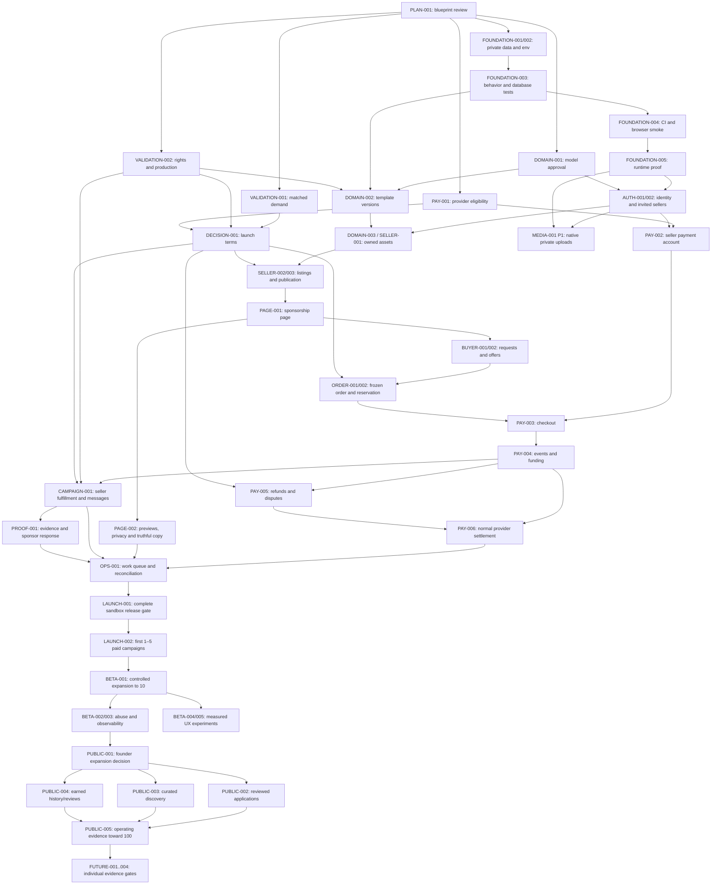

# Dependency-aware roadmap

**Status:** reconciled execution plan, 2026-09-15; PR #52 baseline merged, specific decisions still gated. Product remains Stage 0. [PRD](../product/prd.md) owns scope and gates; [audit](current-state.md) owns current implementation; [backlog](backlog.md) links all 48 fully specified GitHub issues. No backlog feature was implemented by this planning task.

## Start here

**Next implementation issue: [FOUNDATION-003 — Add behavior tests and a disposable Postgres test harness (#6)](https://github.com/Mohith1612/billboard-me/issues/6).** FOUNDATION-001 and FOUNDATION-002 merged in PR #53 and [PR #54](https://github.com/Mohith1612/billboard-me/pull/54). The validated environment/lazy database boundary and existing targeted checks are available; extend them into a reusable harness before FOUNDATION-004 adds CI.

In parallel, founder runs seller/buyer matching ([#9](https://github.com/Mohith1612/billboard-me/issues/9)), physical rights/production trial ([#10](https://github.com/Mohith1612/billboard-me/issues/10)) and provider eligibility ([#11](https://github.com/Mohith1612/billboard-me/issues/11)). These are evidence/decision work, not three product-feature teams. Existing lead protection need not wait for demand validation.

## Dependency graph

Solid arrows are prerequisites; the backlog table contains every issue-level edge. This graph groups only where the issue-level order remains explicit below. An accepted decision means a founder-recorded decision; merged code means the dependency PR has been reviewed/merged and its acceptance verified.

There is deliberately **no PROOF-001 → PAY-006 edge**. The payment lane can be integrated/rehearsed before campaign/evidence UI exists; production launch still needs participant records, evidence/support and both lanes tested. MEDIA-001 is P1 with auth/runtime prerequisites and no P0 dependent; advance it only if agreed original-evidence retention requires it.

The arrows do not imply all three commercial gates can be replaced by code. If PAY-001 fails, the payment lane stops pending a founder-approved commercial redesign. Do not complete the rest of the marketplace hoping eligibility will solve itself. Foundational privacy/testing work still has value.

## Stages, dependency outputs and exit gates

| PRD stage | Issues / inputs | Output needed by the next stage | Verification / gate |
| --- | --- | --- | --- |
| 0 — Current | PLAN-001 #3 / PR #52; PLAN-002 #55; PR #53 access correction | Honest source audit and approved blueprint | Docs PR reviewed by founder; no implemented-state inflation |
| 1 — Engineering foundation | FOUNDATION-001..005 | Private access, env, test commands/CI, runtime choice | Role denial tests, migration harness, browser smoke, exact runtime evidence |
| 2 — Domain foundation | DOMAIN-001..003, AUTH-001/002; physical trial | Agreed keys/roles/inventory templates/ownership | Domain ADR approval; deterministic template import; cross-owner tests |
| 3 — Seller MVP | SELLER-001..003; DECISION-001 | Approved listings with period, price, terms, signals | Real invited seller creates and founder reviews draft |
| 4 — Sponsorship pages | PAGE-001/002 | Public safe projection and clear transactional intent | Mobile/keyboard, metadata/cache privacy, stable URL, truthful policy copy |
| 5 — Buyer/offer flow | BUYER-001/002 | Current immutable proposal with mutual acceptance path | Reject/counter/withdraw/expiry/stale-action tests |
| 6 — Orders | ORDER-001/002 | Frozen terms and exclusive held inventory | Concurrent acceptance, cross-listing overlap and clock/retry cases |
| 7 — Payments | PAY-001 approval, PAY-002..004; refund design | Eligible seller, exact checkout, durable funding | Signed sandbox events, timeout/late-capture/replay and amount checks |
| 8 — Campaign execution | CAMPAIGN-001; approved seller obligations | Funded unique campaign, private messages and seller fulfillment record | Actor/access/change-notice tests; no mandatory platform production controller |
| 9 — Evidence and settlement outcomes | PROOF-001 + independent PAY-005/006, OPS-001 | Sponsor evidence response, normal settlement and support records | Settlement before proof, nonperformance after settlement, refund/recovery race and unresolved-case tests |
| 10 — First real campaign | LAUNCH-001/002 plus commercial gates | First, then 1–5 real complete loops and costs/lessons | Founder live go/no-go; verified bank receipt; actual buyer/seller feedback |
| 11 — Public beta | BETA-001..005; P1 MEDIA-001 when needed | Controlled expansion toward 10 with capacity and repeat-demand evidence | Keep curated supply; implement conveniences only when measured |
| 12 — Marketplace expansion | PUBLIC-001..005 | Public reviewed intake, basic catalogue, earned history; work toward 100 | Founder access decision, support/financial quality, stable unit economics |
| 13 — Future | FUTURE-001..004 | Evidence for one family, procurement model, pricing intervention or corridor | Separate experiment/ADR before each implementation |

There are no calendar promises. External provider approval, seller availability and real event dates control part of the schedule. Use a simple approved period with feasible seller preparation; verify provider advance-booking restrictions. Evidence need not precede normal settlement. The first target is a completed loop, not completion of all 48 issues.

## Safe parallel work

| Work that can run together | Contract / isolation required |
| --- | --- |
| Foundation code + founder demand/production/provider research + domain decision review | Separate docs sections/issue ownership; no shared schema edits; no unauthorized external contact |
| Template SVG/manifest preparation + auth integration | Agreed version/key contracts; one migration owner sequences actual catalogue/auth schema merges |
| Public page presentation + listing operations | Stable public DTO/fixture, same published/privacy states; UI agent does not edit schema or invent inventory |
| P1 private storage adapter + isolated beta UI | Auth permission contract and chosen host fixed; coordinate schema; not a P0 campaign dependency |
| Campaign presentation + payment provider implementation | Agreed lifecycle fixtures; payment owner alone changes financial states and money adapter |
| Beta analytics or catalogue presentation + other isolated UI tasks | Shared access/metrics contracts merged first; no competing package/lock/schema changes |

One issue/branch/worktree per code agent. A fixture-driven UI PR must state that backend behavior is not implemented. Integrate and run whole-journey tests after prerequisite merges; mock-based UI success cannot close a backend issue.

## Sequential ownership

- **Schema/migrations:** one owner at a time, including Better Auth generation, catalogue seeding and financial tables. Merge/rebase prerequisite migrations before generating the next one. No editing applied files.
- **Auth/security:** identity IDs, roles, invitation redemption and public/private data contracts settle before dependent ownership checks.
- **Domain state machines:** order acceptance/reservation/funding, sponsor evidence attribution and independent-settlement authority changes reviewed together; UI agents consume them.
- **Payments:** provider eligibility → provider contract → onboarding → checkout → signed events → refund/reversal safeguards → settlement. Campaign/evidence presentation can advance on fixtures. Normal settlement requires provider financial controls, not proof; full live launch waits for both independent lanes and support readiness.
- **Architectural decisions:** founder accepts ADRs and commercial choices. Agents cannot turn a documented candidate into an accepted choice by installing it.
- **Release:** complete nonproduction rehearsal, then explicit founder live go/no-go, then actual paid campaign. An implementation PR does not authorize executing a live campaign.

## What makes a dependency ready

For code: human-merged PR, relevant checks passed, actual capability documented, no unresolved required acceptance. For decision/validation: evidence attached or privately referenced and founder records decision, constraints and date. Closing an issue without this evidence is not a dependency completion. Reopen/revise dependent work when a decision changes; maintain real GitHub links and this graph.

The [PRD's first vertical slice](../product/prd.md#first-vertical-slice) is the team objective. The [Not Yet list](../product/prd.md#not-yet) remains a scope guard at every stage.
